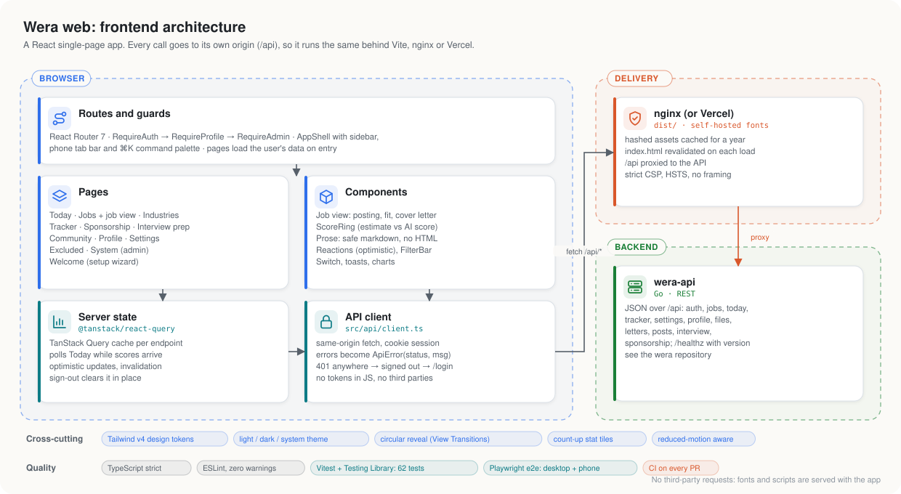

# Wera Frontend

[](https://github.com/jessechumo/Wera-Frontend/actions/workflows/ci.yml)
[](https://github.com/jessechumo/Wera-Frontend/actions/workflows/ci.yml)
[](https://github.com/jessechumo/Wera-Frontend/releases)
[](e2e)
[](tsconfig.json)
[](https://www.conventionalcommits.org)
[](LICENSE)

The dashboard for [Wera](https://github.com/jessechumo/Wera), a self-hosted job radar that collects jobs from public job boards and scores them against your resume using Coral Bricks.

https://github.com/user-attachments/assets/525e661c-765b-4137-98b7-168d57af9690

Each user signs up, uploads a resume, and answers a few questions; the AI drafts a profile they review, and from then on every new posting is scored against it. Wera never applies on your behalf. Every posting opens at its source.

## Architecture



A React single-page app. It calls only its own origin (`/api`), so it behaves the same behind the Vite dev proxy, nginx, or Vercel rewrites, and the session cookie never crosses sites. Server state lives in TanStack Query; route guards send signed-out users to login and users without a profile to setup.

## Features

- **Instant start:** right after setup, Today lists your best matches using local estimates (a dashed ring marked "est.") and swaps in AI scores as they arrive; opening a job scores it on the spot
- **Today:** your review queue ranked by fit, with sponsorship and work-mode badges
- **Jobs:** filterable, searchable table with keyboard navigation (`j`/`k` to move, `Enter` to open, `o` to open the posting)
- **Job view:** the posting beside the fit score, reasoning, and skills you have and lack; your status and notes; a **cover letter** tab that writes, edits, copies and prints a letter for that role; hide a company in one click
- **Tracker:** kanban board from saved to applied, interviewing, offer, or rejected
- **Industries:** your matches in each industry, and every company Wera watches there
- **Sponsorship:** what each company's postings say about visa sponsorship
- **Interview prep:** quick A to D quizzes by topic and difficulty, with explanations
- **Community:** a Medium-style blog with tags, reactions and comments; posts are reviewed by an AI moderator before they go live
- **Profile:** photo, resume (view, download, see the extracted text), preferences and profile text
- **Settings:** theme (light, dark, system), default sort, notification preferences, hidden companies, password, CSV export, account deletion
- **System (admins):** runs, company fetch status, every user's spend, tokens, cache hit rate, and cost
- **Excluded:** every filtered job with the reason and evidence
- **Polish:** a sun and moon toggle with a circular reveal between themes, a soft light palette, count-up stats, staggered entrances, all respecting reduced motion

## Stack

Vite, React 18, TypeScript (strict), Tailwind CSS v4, React Router 7, TanStack Query, Recharts, Lucide icons, Geist fonts (self-hosted). Tests: Vitest, Testing Library, Playwright.

## Setup

Clone this repo next to the backend:

```
projects/
├── wera/            backend
└── wera-frontend/   this repo
```

## Develop

```sh
# in wera/
go run ./cmd/wera serve      # API on :8080

# in wera-frontend/
npm install
npm run dev                  # http://localhost:5173, /api proxied to :8080
WERA_API=http://127.0.0.1:8090 npm run dev   # proxy to another API instead
```

Use port 5173: the API refuses state-changing requests from origins it doesn't know, and the Vite dev server is the one it allows by default.

## Quality checks

```sh
npm run lint        # ESLint, no warnings allowed
npm run typecheck   # TypeScript, including configs and e2e specs
npm test            # Vitest unit and component tests
npm run coverage    # with coverage (text summary and lcov)
npm run e2e         # Playwright against a running API (see e2e/README.md)
```

Unit and component tests render pages with the real API responses saved in `src/api/__fixtures__` and a stubbed `fetch`. The end-to-end tests drive the real app and API through a full journey (sign up, set up, find and track a job, settings, interview practice, log out and in, delete the account) on desktop and phone viewports. CI runs all of them, plus `npm audit`, on every pull request.

## Build

```sh
npm run build                # type-check and build to dist/
npx vite preview --port 3000 # preview the production bundle locally
```

## Docker

The backend's `docker-compose.yml` builds this repo as the `wera-web` service. Nginx serves the app with a strict Content-Security-Policy and other security headers (see `security-headers.conf`) and proxies `/api` to the backend.

```sh
cd ../wera
docker compose up -d --build wera-web   # http://localhost:3000
```

Released images are published to `ghcr.io/jessechumo/wera-frontend:<version>`.

## Deploy on Vercel

`vercel.json` serves the built app with the same security headers and rewrites `/api/*` and `/healthz` to the backend, so the browser sees a single origin and the session cookie works without cross-site settings.

1. Give the backend a public HTTPS address (for example a Cloudflare Tunnel to port 8080) and put it in both `destination` URLs in `vercel.json` (they ship as `https://wera-api.example.com`).
2. Import this repo in Vercel; the framework preset is Vite.
3. On the backend set `COOKIE_SECURE=true`, `TRUST_PROXY=true`, and `PUBLIC_ORIGINS=https://<your-app>.vercel.app`, then restart it.

## Releases and versioning

Commits follow [Conventional Commits](https://www.conventionalcommits.org), checked on every pull request. [release-please](https://github.com/googleapis/release-please) keeps a release PR with the next semantic version and `CHANGELOG.md`; merging it tags the release, bumps `package.json` and publishes the image. The sidebar footer shows the running web and API versions.

## Project layout

```
src/
├── api/          API client, types, React Query hooks, saved responses (__fixtures__)
├── auth/         Login and signup page, route guards
├── components/   Job view, cover letter, ScoreRing, Prose, Reactions, FilterBar, charts
├── layout/       App shell: sidebar, phone tab bar, command palette, navigation
├── lib/          Theme, toasts, formatting, count-up
├── pages/        Today, Jobs, Industries, Tracker, Sponsorship, Interview, Community, Profile, Settings, ...
├── profile/      Resume upload, preference fields, location picker, profile editor
└── test/         Test setup, render helpers, API fixtures
e2e/              Playwright specs and seed data
docs/             Architecture diagram (generated from docs/diagrams)
```

Design tokens for both themes live in `src/index.css`.
